Track Progress Here

### Progress on Hour 2:

Started from flat colors, then rendered and added the light source. I then started the flats for the fox.

#### Progress:

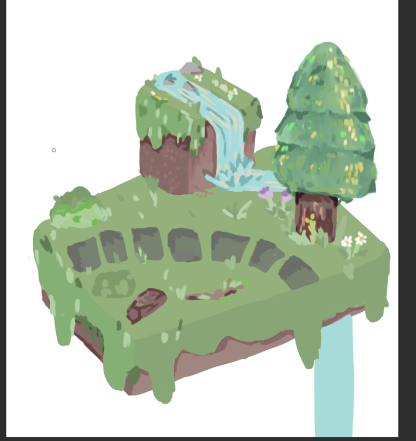
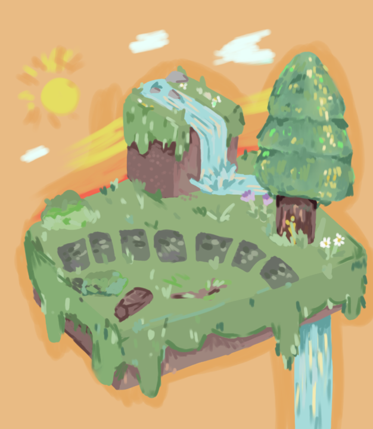

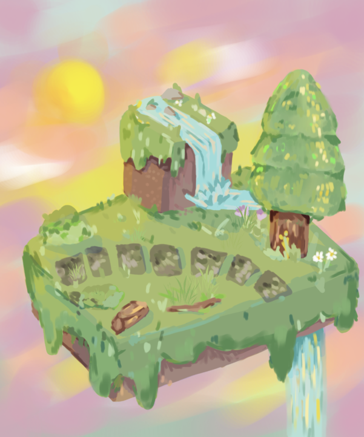
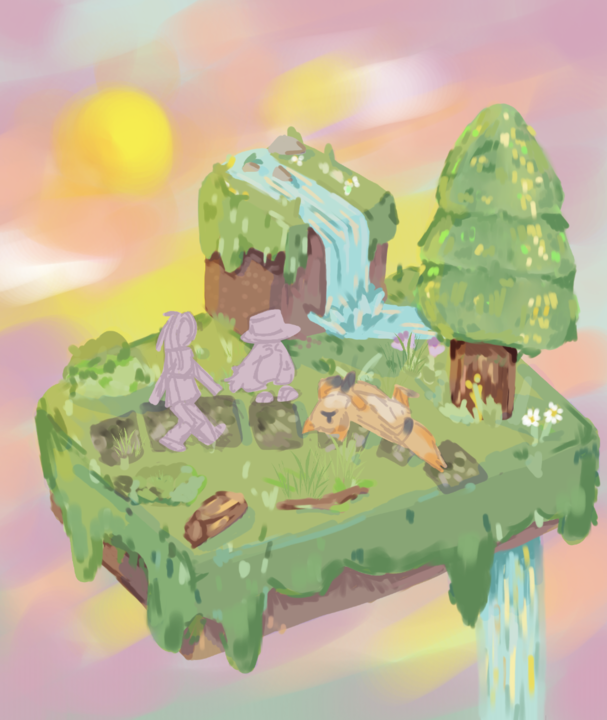

### Progress of Hour 3:

Did the flats for all 3 of the characters and now have pretty much finished the first piece. Just need a few more adjustments next hour then I can add it to the website.

#### Progress:

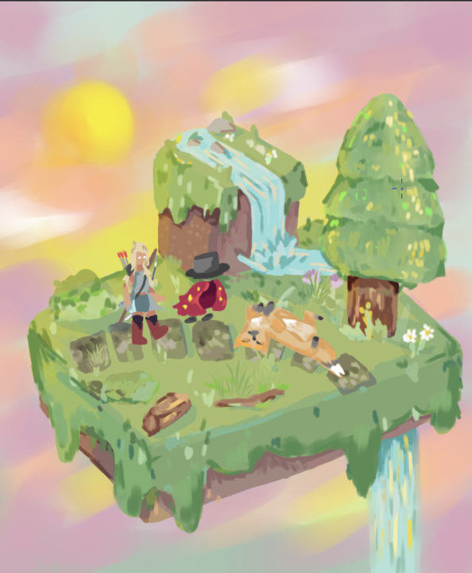
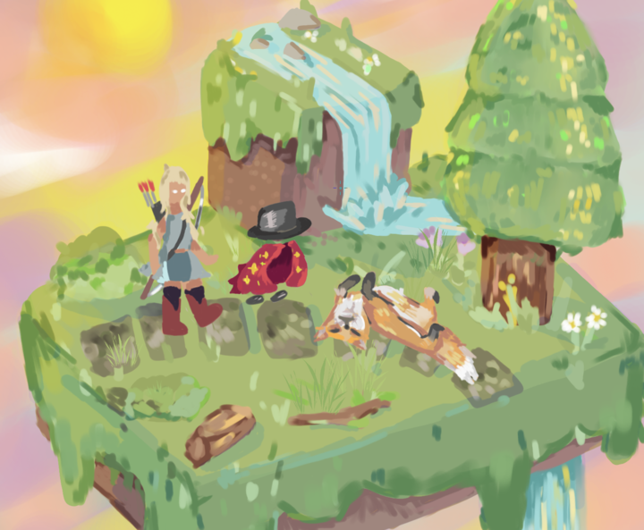
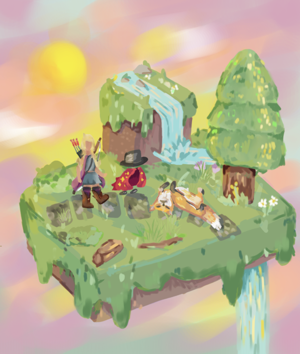

### Progress on Hour 4:

I finished the first piece and then styled it into the website. I then sketched and did he flats of the next piece.

#### Progress:
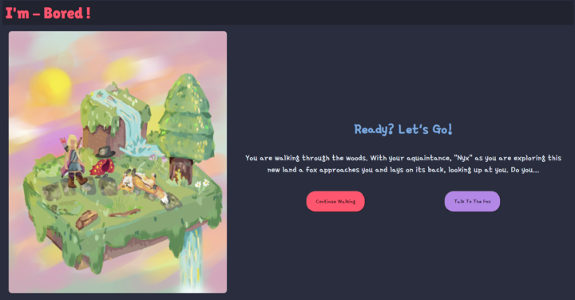
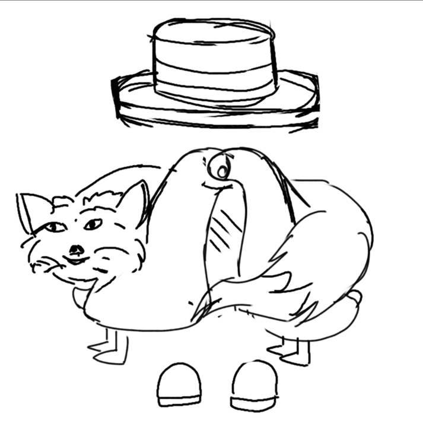
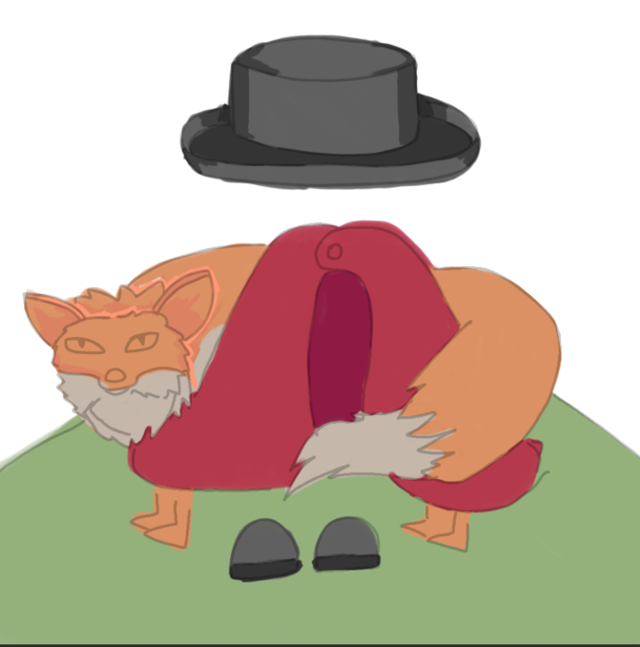
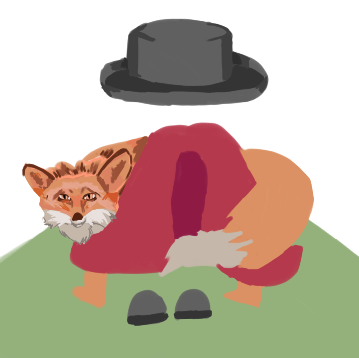
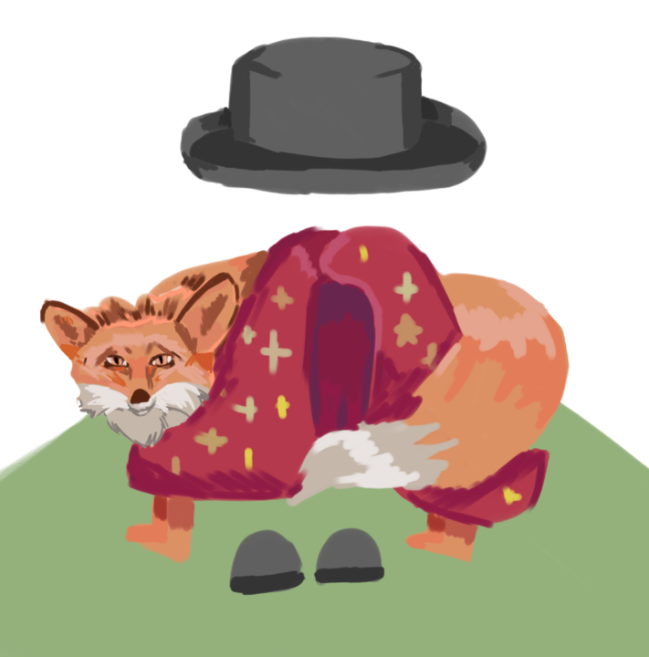